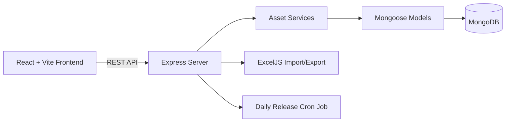
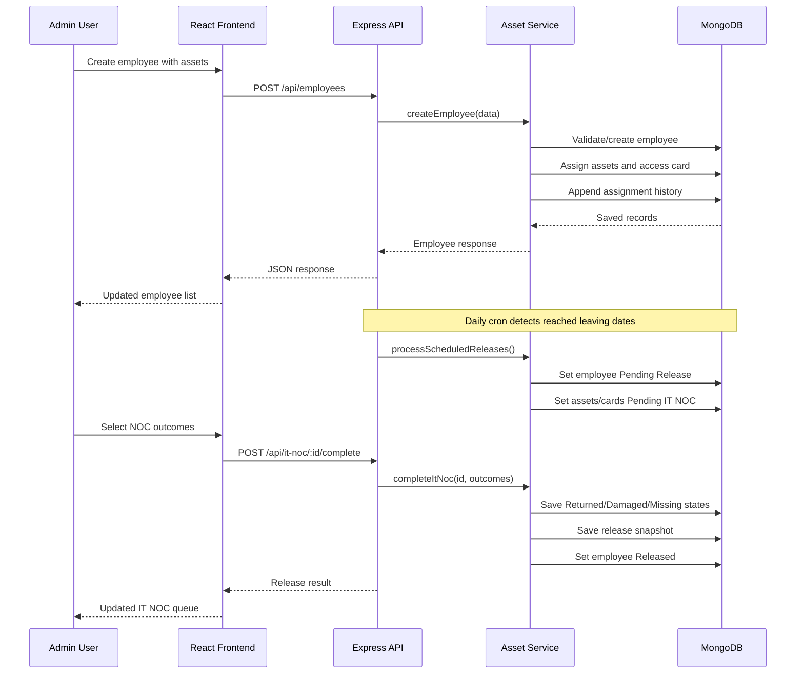

# Employee Asset Management Portal

## Project Overview

This is an IT Asset Management Portal for managing:

- Employees
- IT assets such as laptops, monitors, headphones, and docking stations
- Access cards
- Employee release and IT NOC
- Asset ownership history
- Excel import and export

## Architecture



The frontend is the user interface. It communicates with the backend through REST APIs. The backend applies business rules, stores data using Mongoose, reads and writes MongoDB, handles Excel files, and runs the scheduled employee-release job.

---

# 1. Project Structure

```text
Admin-Asset-Management/
|
|-- client/                         React frontend
|   |-- package.json                Frontend dependencies and scripts
|   |-- index.html                  Browser entry document
|   |-- vite.config.js              Vite configuration
|   |-- eslint.config.js            ESLint configuration
|   |-- src/
|       |-- main.jsx                Creates React root and renders App
|       |-- App.jsx                 Main shell, authentication, state, routes
|       |-- App.css                  Application CSS
|       |-- index.css                Global CSS/Tailwind styles
|       |-- components/
|       |   |-- EmployeeSearchSelect.jsx
|       |-- pages/
|           |-- DashboardPage.jsx
|           |-- EmployeeFormPage.jsx
|           |-- EmployeesPage.jsx
|           |-- InventoryPage.jsx
|           |-- ItNocPage.jsx
|
|-- server/                         Express backend
|   |-- package.json                Backend dependencies and scripts
|   |-- server.js                   Server startup and cron setup
|   |-- config/
|   |   |-- db.js                   MongoDB connection
|   |-- controllers/
|   |   |-- assetController.js       HTTP request/response layer
|   |-- data/
|   |   |-- store.json              Legacy unused data file
|   |-- models/
|   |   |-- employeeModel.js        Employee Mongoose schema
|   |   |-- inventoryModel.js       Inventory item schema
|   |   |-- accessCardModel.js       Access card schema
|   |   |-- appState.js              Legacy unused persistence model
|   |-- routes/
|   |   |-- assetRoutes.js           API endpoint definitions
|   |-- scripts/
|   |   |-- clearDb.js               Deletes database records
|   |   |-- importFromExcel.js       Excel import logic
|   |   |-- runReleaseJob.js         Manually runs release job
|   |-- services/
|   |   |-- assetService.js          Main asset and employee business logic
|   |   |-- releaseService.js        Scheduled release logic
|   |-- test/
|   |   |-- dateStatus.test.js       Employee date/status tests
|   |   |-- releaseService.test.js   Release candidate tests
|   |-- utils/
|       |-- dateUtils.js             Date and employee status helpers
```

---

# 2. Frontend

The frontend is inside the `client` folder.

## Frontend libraries

Defined in `client/package.json`:

- React 19: Builds the component-based user interface.
- React DOM: Mounts React into the browser DOM.
- React Router DOM: Provides client-side page routing.
- Vite: Development server and production build tool.
- Tailwind CSS: Utility-based styling.
- ESLint: Code-quality and linting checks.

## Frontend entry point

`client/src/main.jsx` creates the React root and renders `<App />` inside React Strict Mode.

`client/src/App.jsx` is the main application shell. It contains:

- Login and password reset UI
- Browser-side SHA-256 password hashing
- Remember-me session handling
- Five-minute inactivity timeout
- Global employee and inventory state
- API data loading
- Navigation
- Application routes

## Frontend routes

| URL | Page | Purpose |
|---|---|---|
| `/` | `DashboardPage.jsx` | Dashboard and Excel import/export |
| `/employees` | `EmployeesPage.jsx` | Employee list and search |
| `/employees/new` | `EmployeeFormPage.jsx` | Create an employee |
| `/employees/:employeeId` | `EmployeeFormPage.jsx` | Edit an employee |
| `/inventory` | `InventoryPage.jsx` | Manage cards and IT assets |
| `/it-noc` | `ItNocPage.jsx` | Process employee release and IT NOC |

The frontend currently calls the backend directly using `fetch`, for example:

```text
http://localhost:5000/api/employees
```

There is no separate Axios or API-client layer.

## Frontend pages

### `DashboardPage.jsx`

- Shows employee and inventory statistics.
- Shows pending IT NOC count.
- Downloads Excel reports.
- Uploads `.xlsx` files.
- Links to employee records.

### `EmployeesPage.jsx`

- Displays active, released, and archived employees.
- Searches by name, employee code, card, or status.
- Opens employee details.
- Allows released employees to be reactivated.

### `EmployeeFormPage.jsx`

- Creates and edits employees.
- Captures employee code, name, access card, and leaving date.
- Adds or removes assigned assets.
- Sends data to employee create/update APIs.

### `InventoryPage.jsx`

- Manages access cards and IT assets.
- Searches inventory locally.
- Adds new cards and assets.
- Assigns assets to employees.
- Displays ownership history.
- Marks damaged assets as repaired.

### `ItNocPage.jsx`

- Displays employees waiting for release.
- Requires an outcome for every asset and access card.
- Supports `Returned`, `Damaged`, and `Missing` outcomes.
- Completes the employee release workflow.

### `EmployeeSearchSelect.jsx`

Reusable employee search and selection component used by inventory forms.

---

# 3. Backend

The backend is inside the `server` folder.

## Backend libraries

Defined in `server/package.json`:

- Express: HTTP server and REST API routing.
- Mongoose: MongoDB ODM and schema management.
- CORS: Allows frontend/backend communication.
- dotenv: Loads environment variables.
- Multer: Handles Excel file uploads.
- ExcelJS: Creates and reads Excel workbooks.
- node-cron: Runs scheduled release processing.
- Node built-in test runner: Runs backend tests.

## Server startup

`server/server.js`:

1. Creates the Express application.
2. Enables CORS.
3. Enables JSON request parsing.
4. Mounts routes under `/api`.
5. Connects to MongoDB.
6. Starts the daily release cron job.
7. Starts the server on port `5000` by default.

The daily cron runs at midnight using the `Asia/Kolkata` timezone.

---

# 4. API Routes

All routes are defined in `server/routes/assetRoutes.js`.

## Employees

```text
GET    /api/employees
POST   /api/employees
PUT    /api/employees/:id
DELETE /api/employees/:id
POST   /api/employees/:id/reactivate
```

## Inventory

```text
GET    /api/inventory
POST   /api/inventory/access-cards
DELETE /api/inventory/access-cards/:id

POST   /api/inventory/it-assets
PATCH  /api/inventory/it-assets/:id/repair
DELETE /api/inventory/it-assets/:id
```

## IT NOC

```text
GET  /api/it-noc
POST /api/it-noc/:employeeId/complete
```

## Excel

```text
GET  /api/export/excel
POST /api/import/excel
```

Only `.xlsx` files are accepted, with a 10 MB upload limit.

## Health check

```text
GET /api/health
```

Expected response:

```json
{
  "status": "ok"
}
```

---

# 5. Backend Layers

## Controllers

`server/controllers/assetController.js` is the HTTP layer.

Controllers:

- Receive requests.
- Read route parameters and request bodies.
- Call service functions.
- Return HTTP status codes and JSON responses.
- Convert service errors into API errors.

Controllers contain very little business logic.

## Services

`server/services/assetService.js` contains most business rules:

- Employee creation.
- Employee updates.
- Asset allocation.
- Asset unassignment.
- Access-card allocation.
- Inventory creation.
- IT NOC completion.
- Employee reactivation.
- Excel export.

`server/services/releaseService.js` contains scheduled employee-release logic.

`server/utils/dateUtils.js` contains date parsing and employee-status helpers.

---

# 6. MongoDB Structure

MongoDB configuration is in `server/config/db.js`.

The connection URL comes from the `MONGODB_URI` environment variable.

If `MONGODB_URI` is not set, the fallback is:

```text
mongodb://127.0.0.1:27017/employee-asset-management
```

The active application uses Mongoose and has three main collections.

## `employees` collection

Defined in `server/models/employeeModel.js`.

Important fields:

```text
appId
empCode
empName
accessCard
dateOfLeaving
isArchived
status
assets
releaseSnapshot
createdAt
updatedAt
```

Employee status values:

```text
Active
Pending Release
Released
Archived
```

`assets` is an array of references to `InventoryItem` documents.

`releaseSnapshot` stores the assets and access card an employee had when released. This supports reactivation.

Indexes:

- Unique `appId`
- Indexed `empCode`

## `inventoryitems` collection

Defined in `server/models/inventoryModel.js`.

Important fields:

```text
itemType
serialNumber
category
make
model
description
status
employeeId
employeeCode
employeeName
allocatedTo
history
createdAt
updatedAt
```

Asset status values:

```text
Assigned
Pending IT NOC
Unallocated
Returned
Damaged
Missing
```

`history` records previous ownership:

```text
employeeId
employeeCode
employeeName
assignedAt
returnedAt
status
```

The `serialNumber` field is required, unique, lowercase, and indexed.

## `accesscards` collection

Defined in `server/models/accessCardModel.js`.

Important fields:

```text
cardNumber
employeeId
employeeCode
employeeName
status
assignedAt
returnedAt
createdAt
updatedAt
```

Card status values:

```text
Assigned
Pending IT NOC
Returned
Unassigned
Damaged
Missing
```

The `cardNumber` field is required, unique, and indexed.

## Relationships

The system uses references plus duplicated display data:

- Employee references assets through `Employee.assets`.
- Asset references its current employee through `employeeId`.
- Access card references its employee through `employeeId`.
- Employee also stores the card number in `accessCard`.
- Asset and card documents duplicate employee name/code for easier display.
- Asset history preserves past ownership after the current employee reference is cleared.

This is partly normalized and partly denormalized for easier display and reporting.

---

# 7. Main Business Workflows

## Creating an employee

1. Frontend sends employee details and assigned assets.
2. Backend checks whether supplied serial numbers already exist.
3. Existing assets must be `Unallocated`.
4. Duplicate or already-assigned assets are rejected.
5. Access-card availability is checked.
6. Employee is created.
7. Existing assets are assigned or new asset records are created.
8. Asset history receives an assignment entry.
9. Access card is assigned.
10. Employee stores references to the assets.

## Updating an employee

The backend:

- Updates employee details and leaving date.
- Recalculates employee status.
- Reuses inventory items by ID or serial number.
- Assigns new assets.
- Detects removed assets.
- Clears removed asset ownership.
- Marks the previous history entry as returned.
- Changes removed assets to `Unallocated`.

## Employee release flow

When the leaving date is today or in the past:

1. Employee becomes `Pending Release`.
2. Assigned assets become `Pending IT NOC`.
3. Assigned access cards become `Pending IT NOC`.
4. The employee appears on the IT NOC page.
5. The administrator selects an outcome for every item.
6. The employee becomes `Released`.
7. Assets and cards are detached from the employee.
8. Returned assets become `Unallocated`.
9. Damaged assets become `Damaged`.
10. Missing assets become `Missing`.
11. A `releaseSnapshot` is saved for possible reactivation.

## Reactivation

A released employee can be reactivated.

The system attempts to restore their previous assets and access card.

If an asset is missing or has already been assigned to another employee, it is skipped and reported to the user.

## Repair workflow

Only assets with status `Damaged` can be repaired.

```text
Damaged -> Unallocated
```

The asset then becomes available for future allocation.

---

# 8. Excel Import and Export

Excel functionality is implemented mainly in:

- `server/services/assetService.js`
- `server/scripts/importFromExcel.js`

## Export

The export creates an Excel workbook with:

- Employees sheet
- Assets sheet
- Employee status
- Leaving date
- Asset status
- Current owner
- Asset history

## Import

The importer supports:

- Employees
- Assigned IT assets
- Other assets
- Access cards
- Unassigned inventory

Uploaded files are temporarily stored by Multer and deleted after processing.

---

# 9. Scripts

Located in `server/scripts`:

## `importFromExcel.js`

Imports Excel data into MongoDB.

## `clearDb.js`

Deletes all employees, inventory items, and access cards. Use carefully because it is destructive.

## `runReleaseJob.js`

Manually runs the scheduled release process.

## Available backend commands

```text
cd server
npm install
npm start
npm test
npm run import-excel
npm run clear-db
npm run run-release-job
```

## Available frontend commands

```text
cd client
npm install
npm run dev
npm run build
npm run lint
```

---

# 10. Tests

Tests are located in `server/test`.

## `dateStatus.test.js`

Checks that:

- Future leaving dates remain active.
- Past leaving dates become pending release.
- Empty leaving dates remain active.
- Archived employees remain archived.

## `releaseService.test.js`

Checks that:

- Only eligible employees are selected for release.
- Future employees are excluded.
- Archived employees are excluded.
- Employees without leaving dates are excluded.

There are currently no integration tests for:

- HTTP APIs
- MongoDB persistence
- Employee creation
- Asset assignment
- IT NOC completion
- Excel import/export
- Reactivation

---

# 11. Deployment Caveats

These are important before deployment.

## 1. Frontend API URLs are hard-coded

The frontend currently uses URLs such as:

```text
http://localhost:5000/api/employees
```

In production, these must point to the deployed backend URL.

## 2. Authentication is frontend-only

The password hash and session state are stored in the browser. This is not equivalent to secure server-side authentication.

## 3. CORS is broadly enabled

Production should restrict allowed frontend origins instead of allowing every origin.

## 4. MongoDB fallback message is misleading

`server/config/db.js` logs `using in-memory state` if MongoDB connection fails, but the active services still use Mongoose. The legacy in-memory model is not actually used by the active CRUD flow.

Therefore, MongoDB should be available during deployment.

## 5. There are two persistence designs

`server/models/appState.js` and `server/data/store.json` are legacy files and are not used by the current employee and inventory routes.

The active persistence layer is:

```text
Employee -> employees collection
InventoryItem -> inventoryitems collection
AccessCard -> accesscards collection
```

## 6. Employee card updates need attention

Employee creation synchronizes the `AccessCard` document, but the employee update path primarily changes the employee's `accessCard` string. The corresponding card document may not always be reconciled when editing an employee.

---

# 12. Likely Deployment Questions and Answers

## What technology stack is used?

The frontend uses React, Vite, React Router, and Tailwind CSS. The backend uses Node.js, Express, Mongoose, MongoDB, ExcelJS, Multer, and node-cron.

## Why are there separate client and server folders?

The client is the browser application and the server is the API and database layer. They can be developed, built, and deployed independently.

## Why is MongoDB used?

The system contains flexible employee, inventory, ownership-history, and release-snapshot data. MongoDB stores these related records as documents and supports Mongoose validation and indexes.

## What happens when an asset is assigned?

The asset status becomes `Assigned`, employee references are stored on the asset, the employee receives the asset ID, and a history entry is appended.

## What happens when an employee leaves?

The employee first becomes `Pending Release`. Their assets and access card become `Pending IT NOC`. After every item receives an outcome, the employee becomes `Released` and the items are marked `Unallocated`, `Damaged`, or `Missing`.

## How is ownership history preserved?

Every assignment adds a history entry to the inventory item. During return, that entry receives a return date and final status instead of being deleted.

## Why is the scheduled job needed?

It automatically finds employees whose leaving date has arrived and moves their assigned inventory into the IT NOC workflow.

## What happens if MongoDB is unavailable?

The application should be treated as unavailable for CRUD operations. The current active services depend on Mongoose queries; the legacy in-memory fallback is not connected to the active routes.

## How are duplicate assets prevented?

Asset serial numbers are unique in MongoDB and are also checked by the service before creation or assignment. An asset can only be assigned when its status is `Unallocated`.

## How are duplicate access cards prevented?

Card numbers are unique in MongoDB and checked before creation or assignment.

## Can a released employee be restored?

Yes. The release snapshot records the employee's previous assets and card. Reactivation restores items that are still available and reports items that are missing or reassigned.

## How does Excel import work?

The frontend uploads an `.xlsx` file to the backend. Multer temporarily stores it, ExcelJS reads it, the importer writes valid records to MongoDB, and the temporary file is deleted afterward.

---

# 13. Short Explanation for Presentation

> The application is a React frontend backed by an Express REST API. The backend uses Mongoose to store employees, inventory items, and access cards in MongoDB. Asset assignment is handled in the asset service, while employee release is a scheduled workflow. When an employee's leaving date arrives, their assets and access card move into Pending IT NOC. Once every item is marked Returned, Damaged, or Missing, the employee is released and the asset history is preserved. Reactivation uses a saved release snapshot to restore still-available assets.

---

# 14. One-Minute Data Flow


